#### 2019 - 06 - 26 (1일차)

# 가상머신SW & 리눅스 설치 , 용어 조금 정리

앞으로 배울 꺼 스케줄 대략 – 앞으로 3-4개월!

1. Linux

2. 빅데이터 학습 준비 -> Python & Pandas

3. 빅데이터 -> Machine Leaning(TensorFlow)

4. 빅데이터 저장 -> 하둡

5. 빅데이터 분석 -> R

6. 안드로이드

7. IOT(아두이노)

이론(30%)+실습(70%)

그날 배운거 정리 = [네이버 블로그 활용해보기](https://blog.naver.com/son960311)

**목차**

- 환경구축(VMWare)

- CentOS설치

- 필수개념과 명령어

리눅스를 알아야지 하둡 사용 할수 있다. 

가상머신을 만들 수 있는 플랫폼을 설치(VMWare)하고 가상머신에 리눅스 설치 할꺼임!!!

긍데 교육센터 PC 사양이 안좋아서 너무 오래걸렸드아,,,

## 1.설치하기

#### 1.1 VMWare Player 설치 

[사이트](https://www.vmware.com/kr/products/workstation-player.html)

최신버전으로 다운로드!

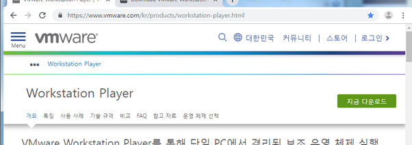

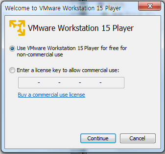

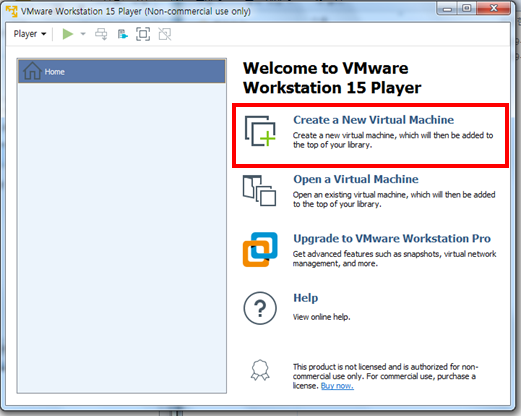

새로운 가상머신을 만든다.

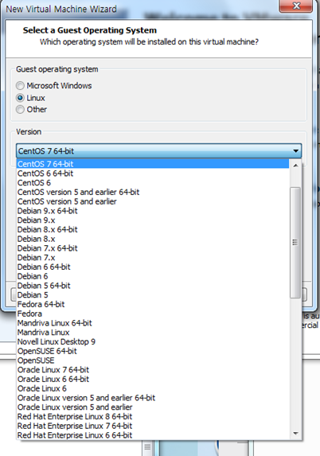

다양한 배포판이 있다.(CentOS)

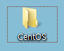

만든 가상머신 파일들을 저장할 폴더 CentOS를 바탕화면에 만들어 준다.

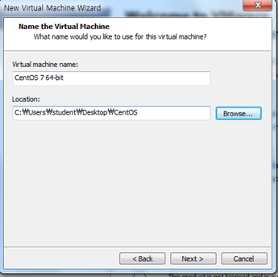

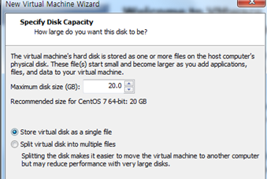

20기가를 초과할 수 없다고 한다.

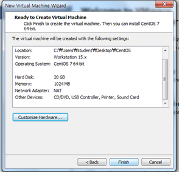

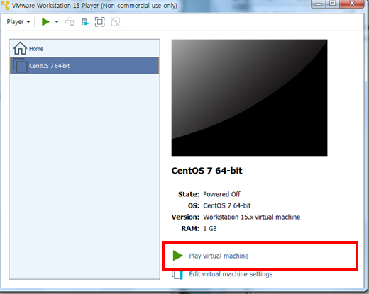

가상의 컴퓨터를 하나 생성했다. - CentOS 64-bit

**오전 수업**

- VMWare player5 설치

- 가상머신 소프트웨어(VMWare,Virtual Box)

- VMWare WorkStation(유료)

- VMWare WorkStation Player(무료)

- 호스트 OS(윈도우), 게스트 OS(리눅스)

- 최신버전의 CPU에서는 Player5를 사용하지 못함

**오후 수업 예정**

- P76부터

- 레드햇 리눅스 = 센토스 리눅스

- GPL 라이선스 = 소프트웨어의 수정과 공유를 하는데 있어 자유를 보장함

#### 1.2 VMWare player5 설치 - PC 사양에 맞춰서,,,,다시

교육센터 컴퓨터 사양이 낮아서 다시 설치!

[사이트](https://www.centos.org/download/)

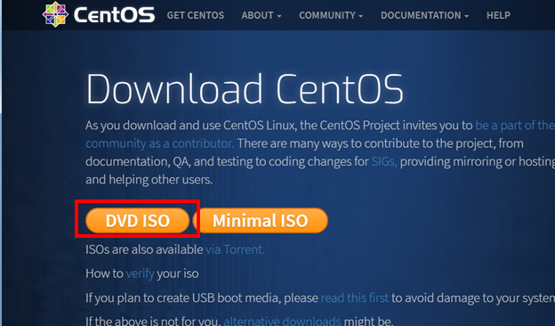

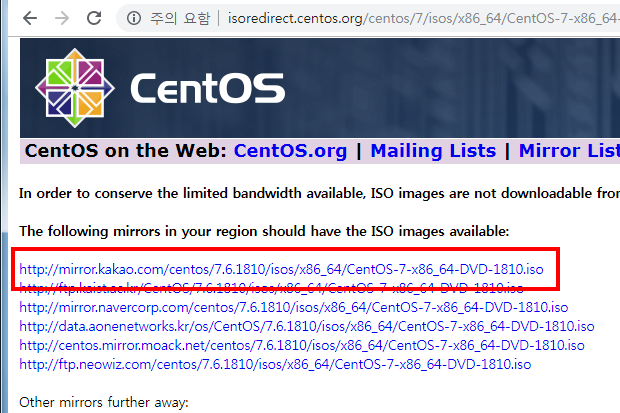

**VMWare player5 설치** - default값으로 설치

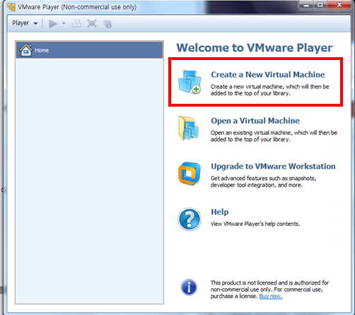

#### 1.3 CentOS 

새로운 가상머신 생성

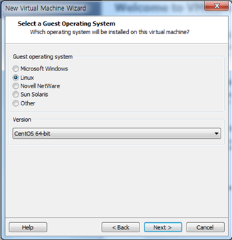

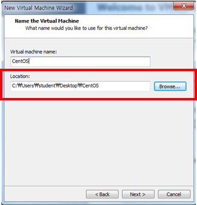

Host PC에 가상프로그램에 대한 파일들을 어디에 저장할껀지 지정(바탕화면에 CentOS파일 만들었던거에 저장)

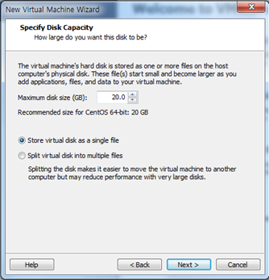

사이즈 20기가 / 하나의 파일(single file)로 만들어서 관리

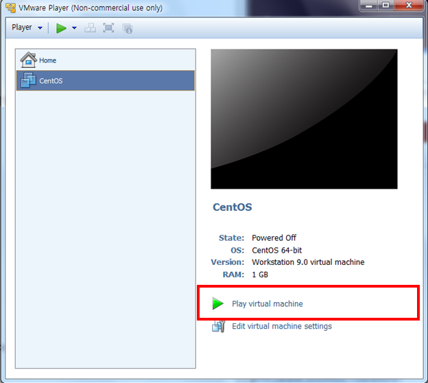

play virtual machine 을 실행하면 화면이 뜨는데 `Ctrl + alt` 누르면 마우스 빠져나갈수 있음!

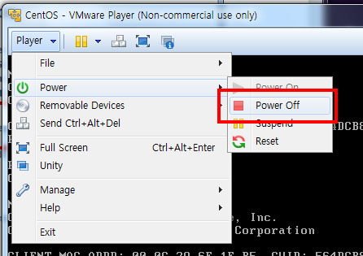

프로그램 종료하기

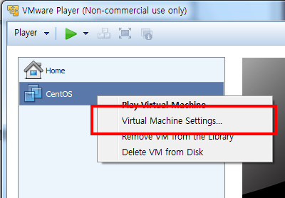

다운받은 CentOS 설치하기위해서 Settings 를 클릭한다.

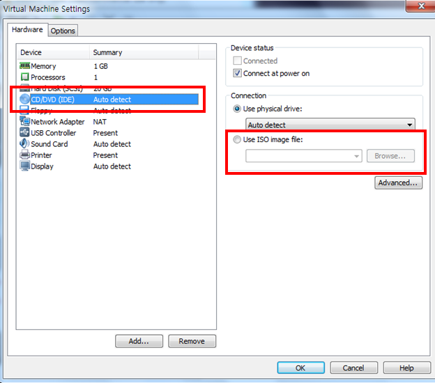

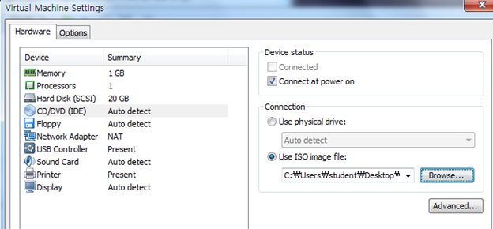

설정한뒤 ok 누름

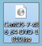

https://www.centos.org/download/ 에서 다운받기

실행되면 이제 이런 창이 뜬다.

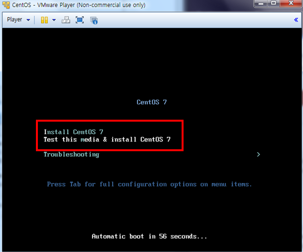

`Install CentOS 7`을 클릭하면...

**언어 선택하기**

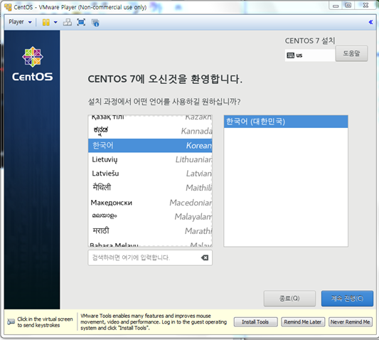

한국어 선택

**소프트웨어 선택**

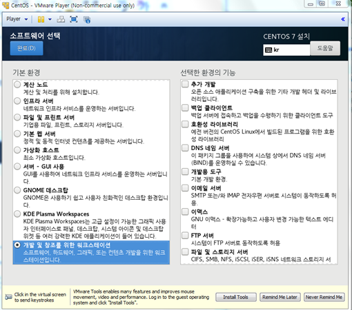

소프트웨어 선택한 뒤 소프트웨어 종속성 확인을 기다린다. 

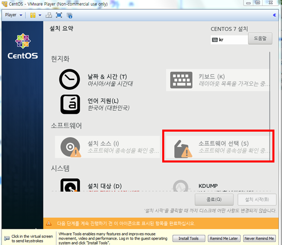

**설치대상(D)**

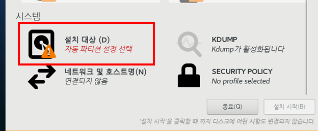

`설치대상 (D)` : 자동 파티션 설정 선택 / 윈도우 파티션나누는거 생각하면됨

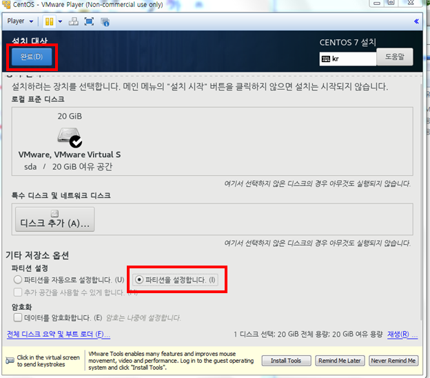

`설치대상(D)` 누르면  기타저장옵션에 **파티션을 설정합니다** 선택후 `완료` 선택

완료를 누른후 기다리면 이화면이 뜸 `여기를 클릭하여 자동으로 생성합니다` 클릭

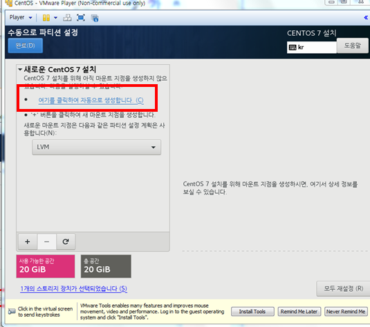

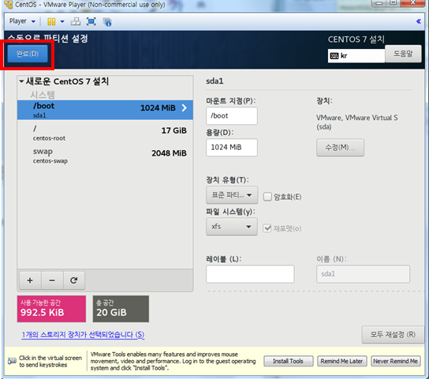

Swap 부족한 부분에 대한 전체 디스크의 10% 정도로 설정하고 완료 클릭

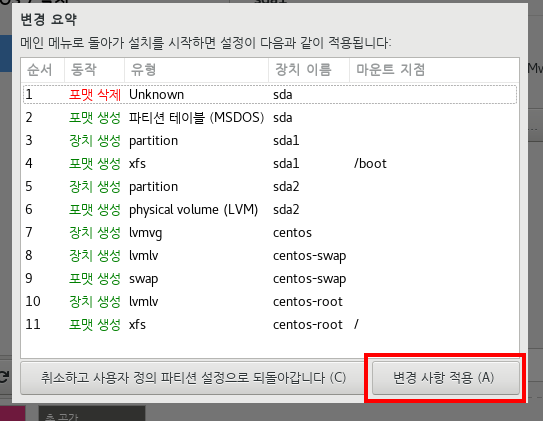

완료후 뜨는 창인데 변경사항 적용 클릭

**네트워크 & 호스트 명 설정**

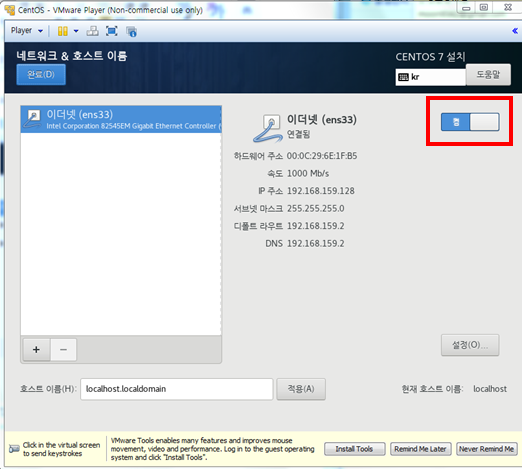

켬으로 변경한다.

 

**설치시작**

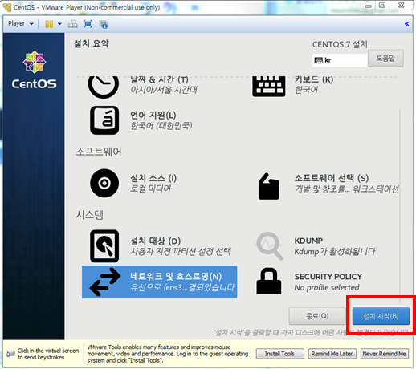

설치시작을 누르면

이와 같은 화면이 보이는데 root암호와 사용자 생성을 하면된다.

**암호설정**

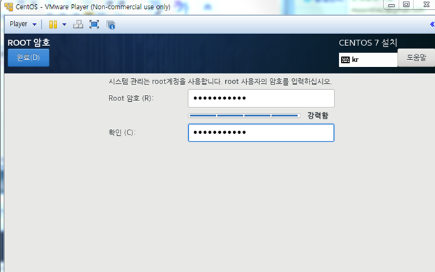

**사용자 생성**

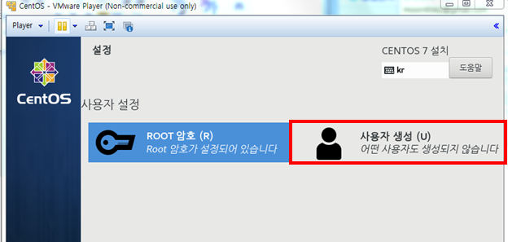

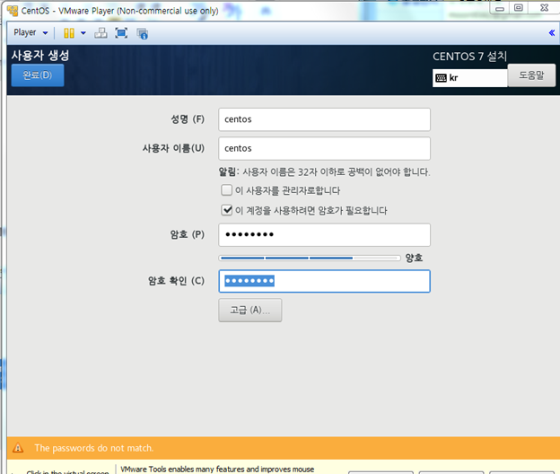

#### 1.4  virtualbox 설치

[사이트](https://www.virtualbox.org/)

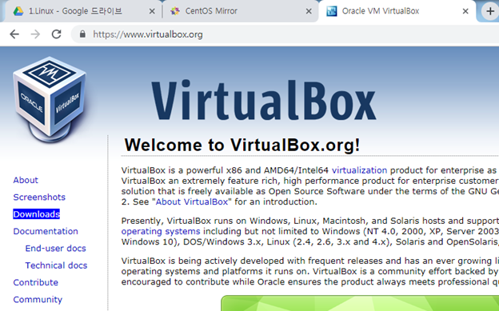

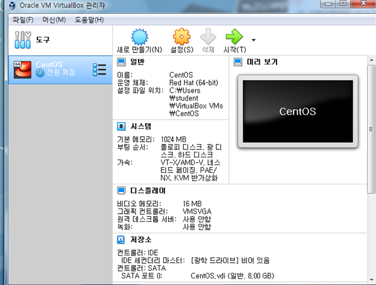

가상머신만들기 default값으로 지정된거 그대로설치

**설정 저장소**

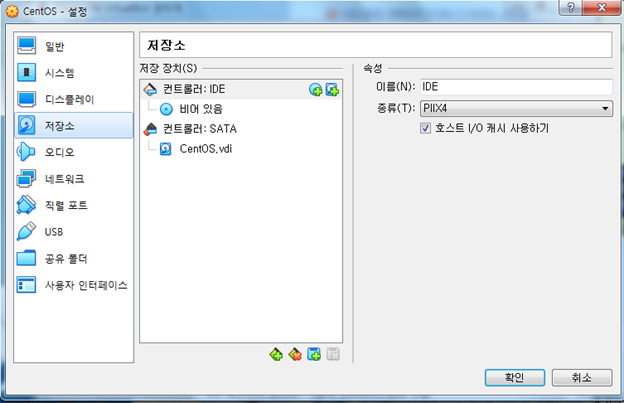

설정 저장소 - 컨트롤러 : IDE 삭제 후 광학드라이브 추가

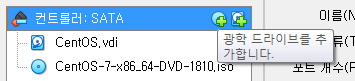

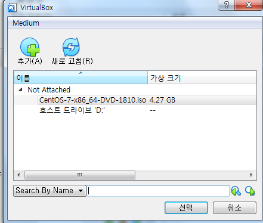

## 2. 수업내용 정리_리눅스 명령어

1. VMWare Player 설치(5.0버전)

2. CentOS 설치

3. 필수 개념과 명령어

/ 가 root 

Terminal을 실행

- 관리자 로그인
  - 아이디 : root
  - 비밀번호 :  설정해논 번호!

- 종료 

  - shutdown –P now

  - halt –p

  - init 0 ( runlevel )

- 재시작 
  -  shutdown –r now
  - reboot
  - init 6

- 로그아웃
  - exit
  - logout

- 가상 콘솔 : 최대 6개의 사용자로 로그인 가능
  -  CTRL + ALT + F1~F6
  - Ctrl + Alt+F1 : x 윈도우
  - Ctrl + Alt+F2 : 다른 사용자로 로그인
  - Ctrl + Alt+F3
  - Ctrl + Alt+F4
  - Ctrl + Alt+F5
  - Ctrl + Alt+F6

- RunLevel : init 명령어 뒤에 붙는 숫자를 의미

  RunLevel 숫자마다 의미가 정해져 있음

  - init 0 : 종료모드

  - init 1 : 시스템 복구모드
  - init 2 - 4 : Text기반 다중 사용자 모드
  - init 5 : 그래픽기반 다중 사용자 모드
  - init 6 : reboot

- **pwd **( print working directory )

- **cd** ( change directory )

- Terminal을 실행시킨 후 working directory를 /lib/systemd/system 으로 이동하면 RunLevel에 대한 정보를 확인할 수 있다.

- ls( list ) : 현재 디렉토리 안의 파일이나 디렉토리의 목록을 출력

- ls –al : 상세한 정보 포함 출력

- ls –al runlevel* : RunLevel이라는 글자로 시작하는 것만 필터링해서 출력
- /lib/systemd/system 안의 runlevel*(all) 을 li 로 출력

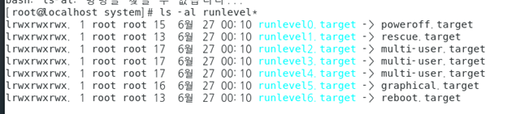

- RunLevel 0~6이 특정 타겟을 지칭함

- 첫 부팅 시, RunLevel 5로 실행

  => 처음 부팅 시 어떤 runlevel로 실행할지를 지칭하는 링크가 있다. (링크는 바로가기 아이콘 정도로 이해)

  => /etc/systemd/default.target

- 이 링크를 다른 target으로 변경
  
  - ln –sf /lib/systemd/system (지칭되는 곳)/multi-user.target
  
    etc/systemd/system (지칭되는 곳)/default.target

: 부팅 시, text 기반

- 원상복귀
  
  - ln –sf /lib/systemd/system (지칭되는 곳)/ graphical.target
  
    etc/systemd/system (지칭되는 곳)/default.target

: 부팅 시, graphic 기반