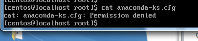

#### 2019 - 06 - 27 (2일차)

# Linux_Basic_1

**오전**

- 자동완성

  파일이나 디렉토리의 이름의 일부만 입력한 후 Tab키를 이용해서 완성하는 기능.

- ls(list) 

  기본적인 파일과 디렉토리의 리스트를 보여주는 명령어
  - ls -a : 숨김파일(.으로 시작)을 포함한 모든 파일을 보여주기위한 옵션은
  - ls -l :파일에 대한 자세한 사항(퍼미션,소유자,그룹,파일크기등)

    => ls -al 형태로 많이 이용

  - ls -al : 숨김 파일까지 포함한 상세한 정보 포함 출력
  - ls -al runlevel* :  runlevel이라는 글자로 시작하는 것만 필터링해서 출력

- cat

  파일의 내용을 확인하고 싶을때 간단하게 사용하는 명령어

  #cat anaconda-kr.cfg == #cat anacon[Tab]

  cat anacon[Tab] ( 자동완성이 가능한 경우에 자동완성동작)

 만약, anacon으로 시작하는 파일이 없거나 여러 개 있는 경우는 [Tab]을 통해 자동완성을 할 수 없다.

  자동완성을 할 수 없는 경우[Tab]을 두번누르면 anacon로 

  시작하는 모든 파일을 listing

 

- 기본적으로 도스키를 제공

  화살표키 위,아래를 이용해서 기존에 사용했던 명령을 다시 이용


## Window System의 메모장같은 Text Editor를 사용해 보기

- **gedit** 

  해당 프로그램은 `GNOME`이라는 윈도우 매니저를 이용하는

  경우에만 사용이 가능.

- Linux 내 한글 전환 : 윈도우 키 + 스페이스

  - 리눅스에서는 확장자의 의미가 없음 , 그저 하나의 파일 이름에 불과함

  - startx : text 기반의 command에서 x윈도우를 동작시킬 수 있다.


## Text 기반의 Edit

- text 기반의 command에서는 gedit와 같은 그래픽 기반의 명령들을 수행할 수 없다.

- 터미널 모드인 경우 전통적으로 **vi**라는 에디터를 이용

- vi에디터 - 2가지의 모드
  - 입력모드 : 데이터, 글자를 수정하거나 입력할 때
    - 입력모드로 진입하기위해서는 i key나 a key를 사용.
    - i : 현재 커서 위치에서 입력모드로 진입
    - a : 현재 커서의 다음 위치에서 입력모드로 진입
  - ex 모드 : 저장하거나 빠져나올 때
    - 입력모드를 빠져나와 ex mode로 진입하기 위해서는 ESC key를 이용
    - shift키 + :(콜론) + w : 저장 후 EX모드에 계속 위치함
    - wq : 저장하고 끝내기
    - q! : 저장하지 않고 끝내기
    - x 키 : 현재 커서가 위치한 곳의 한글자를 지움
    - dd 따당: 지우기를 원하는 행의 행 전체를 지움
    - ndd : 여러 줄 삭제
      - 3dd : 현재 커서 라인에서 3 줄이 삭제
    - yy : 해당 라인 전체를 복사
    - nyy : 여러 줄 복사
      - 3yy : 현재 커서 라인에서 3 줄이 복사
    - !v : 현재 히스토리 중 v라는 명령어로 시작하는 명령어를 실행
    - p : 복사된 라인을 원하는 곳에 붙여넣기


## 마운트

- 물리적인 장치(하드디스크, CD/DVD, USB)들을 사용하기 위해서 특정한 위치(디렉토리)에 연결하는 과정
- 각각의 물리적인 저장장치는 각각의 이름이 따로 있음 
  - CD/DVD에 대한 장치 이름 => /dev 안에 cdrom이라는 이름으로 잡혀있다.

- #cd /dev  : 현재 working directory가 /dev로 변경

- #ls -al cdr* : cdr이라는 이름으로 시작되는 놈들 다 listing 됨
  - 실제 장치의 이름은 /dev/src0
  - cdrom 은 symbolic link로 일종의 바로가기 이름

- 현재 자동으로 mount된 CD/DVD의 위치는 /run/media/root/CD타이틀 형태로 마운트


## U마운트

- 현재 자동으로 mount가 되어 있는데 mount를 해제 

일단 사용자의 home directory로 이동

​	(# cd)

​	\# umount /dev/cdrom(/dev/sr0)

- 이번에는 특정 mount point(directory)를 이용하여 CD/DVD를 mount해보기

  \#mkdir mycdrom  (make directory)

- mount 명령을 이용해서 CD/DVD를 특정 디렉토리와 연결

  \#mount –t ios9660 /dev/cdrom /root/mycdrom/

 

## IOS파일을 제작해서 mount 해서 사용해보기

- IOS파일(.ios) : 국제표준기구(IOS)가 표준으로 제정한 광학 디스크 압축파일

  Linux에서는 이런 ios파일을 쉽게 만들 수 있다.

  사용하는 프로그램은 `genisoimage`

  해당 프로그램이 우리 시스템에 설치가 되어있는지부터 확인!! 

  - 레드햇 패키지 매니저 = rpm

  - rpm을 이용해서 해당 프로그램(package)가 설치되어있는지를 확인

  - RPM(RedHat Package Manger)

    - rpm –qa geniosimage : 해당 프로그램이 시스템에 설치되어 있는지 확인 -> 만약, 설치가 되어있지 않으면, 설치를 우선적으로 진행한다.

      현재 설치되어 있음

    - 이프로그램을 이용해서 /boot 디렉토리의 내용을 ios 파일로 압축할거임

      \# geniosimage –r  –J  –o boot.iso  /boot

- boot.iso라는 이름으로 /boot 안의 모든 것을 압축
- mybootimage 디렉토리를 생성하여 boot.iso를 마운트


## 필수적인 명령어(p183~)

1. **ls ( list )** : 파일과 디렉토리의 목록을 출력하기 위해 일반적으로 사용하는 옵션은 –al을 많이 이용

2. **cd** ( change directory ) : working directory를 이동하기 위해서 사용

   cd명령에 인자를 주지 않으면 현재 사용자의 home directory로 이동

   . ( 현재 디렉토리 의미 ) .. ( 상위 디렉토리 의미 )

3. **pwd** ( print working directory )

4. **rm** : 파일이나 디렉토리를 지울 때 사용 , 많이 사용하는 옵션은 –rf를 이용
   - -r : 재귀적으로 특정 디렉토리와 그 안의 디렉토리들을 삭제할 때 사용
   - -f (force) : 강제적으로 삭제, 강제적으로 모두 날림 
   - rm – rf /root/myiso

5. **cp** : copy의 약자로 파일이나 디렉토리를 복사할 때 사용
   - cp abc.txt bbb.txt

6. **touch** : 파일 크기가 0 인 파일을 생성할 때 사용
   - touch newfile 
     - newfile이라는 파일이 없는 경우 파일 사이즈가 0인 새로운 파일이 생성
     - 현재 newfile이라는 이름의 파일이 있는 경우에는 해당 파일의 수정날짜를 현재 날짜로 변경

7. **mv** : move의 약자로 파일을 이동할 때 사용, 파일이나 디렉토리의 이름을 변경할 때 사용
   - mv aaa.txt bbb.txt

8. **mkdir** : make directory. 새로운 디렉토리를 생성.

9. **rmdir** : rm directory. 디렉토리를 삭제하기 위한 명령단, 디렉토리안에 파일이나 다른 디렉토리가 없어야한다.

10. **cat** : concatenate. 텍스트로 작성된 파일의 내용을 출력

11. **head, tail** : head는 텍스트파일의 상위 10줄. tail은 텍스트파일의 하위 10줄 출력

12. **more** : cat과 유사한 기능. 텍스트 파일의 내용을 페이지 단위로 출력

13. **clear** : terminal을 깨끗이 지워줌


## 사용자 그룹과 퍼미션(p186~)

- 리눅스는 다중 사용자 시스템
- 기본적으로는 root라는 이름 superuser가 존재
- 모든 사용자는 특정 그룹에 속해 있음
- 리눅스 시스템의 모든 사용자는 /etc/passwd 파일에 정의되어있음

\-    /etc/passwd 파일의 내용

```bash
root:x:0:0:root:/root:/bin/bash
```

사용자이름 :패스워드 :사용자ID :그룹ID : 사용자전체이 :홈디렉토리 :기본 쉘(명령어 해석기)

쉘 : 중간에 명령어를 해석해주는 , 없으면 해석불가

​	\# cat /etc/passwd

- 각 사용자에 대한 비밀번호는 /etc/shadow파일에 정의되어 있음

   \# cat /etc/shadow

- 그룹에 대한 정보는 /etc/group 파일에 들어있음

- 새로운 사용자를 추가

  \# useradd teatuser : testuser라는 이름의 사용자를 추가

- 새로운 사용자 추가할 때 특정 옵션을 이용하지 않고 사용자를 추가하게 되면 사용자ID는 맨 마지막 사용자ID에 +1해서 생성된다.

  \# useradd –u 1111 teatuser : 사용자를 추가할 때 특정 사용자의 ID를 사용할 수 있음

  \# useradd –g root testuser : 사용자를 추가할 때 사용자의 그룹을 root 그룹으로 추가

  \# useradd –d /newhome testuser : 기본적으로 일반 사용자의 홈디렉토리는 /newhome/testuser로 잡힌다.

**실습**

​	\# useradd –g centos testuser

- 새로운 사용자 추가 성공 , 아직 로그인은 할수 없다.(비밀번호 설정을 안했음)

  \# passwd testuser

Ctrl +alt +F2 -> 가상콘솔창 띄우기 F1은 나가기

비밀번호 변경 : youngsun3

이런 일련의 내용이 머리속에 있어야함

많이 써보는게 최상의 방법

Window 대신 Linux를 메인 OS로 사용해보기


---


- 사용자의 정보를 수정하려면?

  \# usermod –g root testuser

- 사용자를 삭제하려면?

  \# userdel –r testuser

- -r 옵션을 주면 해당 사용자의 홈디렉토리도 같이 삭제 


## 파일과 디렉토리의 소유와 허가권(p194~)

ls –al 중에

**-rw-r--r--. 1 root root    83 6월 27 21:43 sample.txt**

1. 맨 앞에 1칸은 이 파일의 종류를 지칭

​      \- : 파일을 지칭

​      d : 디렉토리를 지칭

​      l : 링크(심볼릭링크)를 지칭

2. 그 뒤에 9칸은 해당 파일 (디렉토리)의 퍼미션을 지칭

   **rw-       r--        r--**

   소유자의 퍼미션  그룹의 퍼미션  other의 퍼미션

   **rw-       rw-        ---**

   이렇게 변경하면 리딩도안되고 수정도 안되고 다안됨

   421(숫자로 표현 가능)

   r : readable ( 읽을 수 있는 )

   w : writable ( 수정할 수 있는 )

   x : excutable ( 실행할 수 있는 )

    

[root@localhost ~]# ls -al

합계 137678

d r-x r-x --- . 15 root root   4096 6월 27 21:49 .

dr-xr-xr-x. 17 root root    224 6월 27 00:43 ..

-rw-------. 1 root root   1550 6월 27 20:14 .ICEauthority

-rw-------. 1 root root    328 6월 27 02:19 .bash_history

콘솔창에서 centos 로 로그인해서


한글깨져서 저렇게 보이는거임

아나콘다 접근 불가능 -> cat으로 확인



logout하면 로그아웃됨

- -rw-r--r--. 1 root root    83 6월 27 21:43 sample.txt =>644퍼미션 

  소유자와 같은 그룹의 사람만 해당 파일을 읽거나 수정이 가능한 상태로 만들고 실행은 안되게 설정해보기

  rw-   rw-   --- 

  => 660

- 파일의 퍼미션 변경하기

\# chmod 660 sample.txt

- 파일의 소유자와 그룹을 변경할 수 있다.(p197~)

  \# chown centos sample.txt => 해당 파일에 대한 소유자를 변경, 소유권변경

  \# chwon centos.centos sample.txt => 해당 파일에 대한 소유자와 그룹을 동시에 변경

  \# chgrp centos sample,txt => 해당 파일에 대한 그룹만 변경

   

## Linux의 파일 시스템 = inode 기반 자료구조 구성(링크p201~) 

리눅스/유닉스의 파일 시스템에서 사용하는 자료구조

파일이나 디렉토리의 여러 가지 정보가 들어있다.

inode 객체는 해당 파일에 대한 퍼미션 정보를 가지고 있음, 실제 데이터는 데이터 블록이라는 disk 어딘가에 있으며, inode를 통해서 접근

- 심볼릭 링크 = 바로가기와 같음
  - link에 대한 inode가 만들어짐 . 원본 파일을 가리키는 inode.
  - 실제 데이터를 보기 위해서는 link의 inode를 통해 원본 파일에 접근하고, 원본 파일의 inode를 통해 실제 데이터제 접근한다.