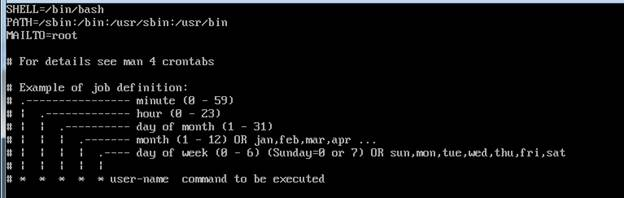

#### 2019 - 06 - 28 (3일차)

# Linux_Basic_2

기본적인 Linux 사용에 대한 내용을 알게되면 그다음은 각종 application 의 설치에 관한 내용으로 넘어간다.

#### 패키지 설치 

- RPM ( RedHat Package Manger )

package : window에서 말하는 exe 설치파일. (.rpm)

- rpm –Uvh 패키지이름.rpm  ( -U : 설치/업그레이드 , -v : 설치과정을 출력, -h : 설치진행도 #으로 출력)

#### 패키지 삭제

- rpm –e 패키지 이름

  => 다 좋은데 패키지의 의존성 관리가 안된다.

  ​	=> 이 문제를 해결하기 위해서 YUM ( Yellowdog Updater Modified )

  ​	설치 : yum install 패키지이름

  ​	삭제 : yum remove 패키지이름

  ​	Ex) yum install emacs

   	yum install mysql

#### 파일 압축 ( 파일 1개를 압축 )

많이 사용되는 압축파일 형식 ( xz, bz2, zip )

- 사용하는 방법 

=> 파일을 압축할 경우 : xz 파일명  / 파일을 압축한 후에 원본 삭제

​	  파일 압축을 해제할 경우 : xz –d 압축파일명

- 특정 디렉토리 안의 모든 파일들을 압축해서 파일 1개로 만들고 싶을 때

  특정 디렉토리 안의 파일들을 파일 1개로 묶은 후에 압축 

  tar 명령을 이용해서 파일을 묶고 푼다.

  => 파일을 묶을 때 : cvf

  묶인 파일을 다시 풀 때 : xvf

  \# tar cvf 묶은파일명(boot.tar) /boot

  \-    파일(디렉토리)를 찾을 때

  => find [경로] [옵션]

  ​	 find /boot –name “*.conf”

  ​	 find /boot –size +10k –size -100k

#### CRON

주기적으로 반복되는 작업을 자동화 시킬 수 있는 도구

관련 파일 : /etc/crontab 파일

반복 작업 : crond라는 데몬 프로세스가 실행

vi /etc/crontab

i눌러서 insert 모드로 :q!저장안하고 나가는거 :w저장하고 그자리 :wq저장하고나가기

=> 01 00 * * * root touch test.txt

#### AT

CRON과 유사하지만 반복이 아닌 일회성 작업을 예약

​	\# at 3:00am tomorrow

​	\# at now +1 hours

​	\# at now +1 minutes

​	Ctrl + D

#### ps

현재 수행되고 있는 process의 목록을 살펴보는 명령어 - 작업관리자 

모든 프로세스를 살펴보기 위해서는 –ef 옵션을 이용

\# ps –ef

포그라운드 

-z

현재 gedit라는 프로세스가 살아있다(stopped)

ps –ef를 이용하면 현재 gedit의 프로세스 ID를 확일할 수 있음

이 프로세스 ID(pid)를 이용하면 현재 프로세스를 제거 할 수 있음

​      Kill -9 pid : 해당 프로세스를 중지시킴

리눅스는 여기까지!! 빅데이터분석 파이썬 시작!!